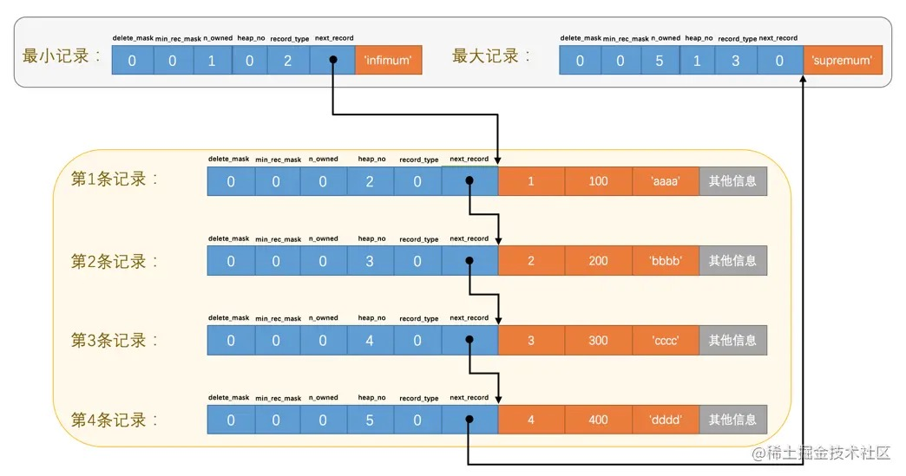
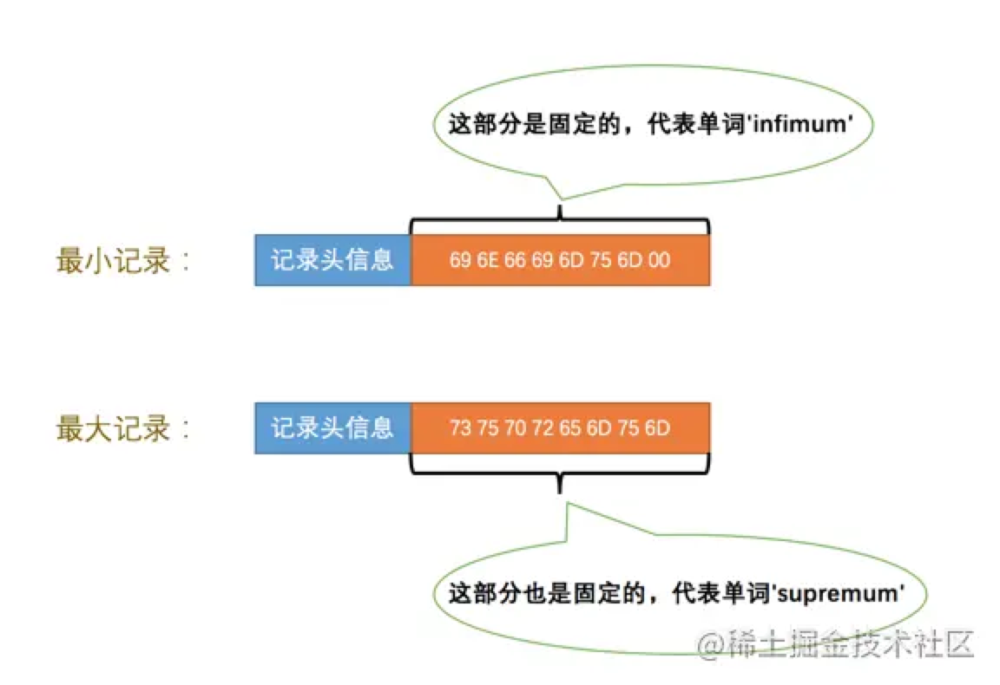
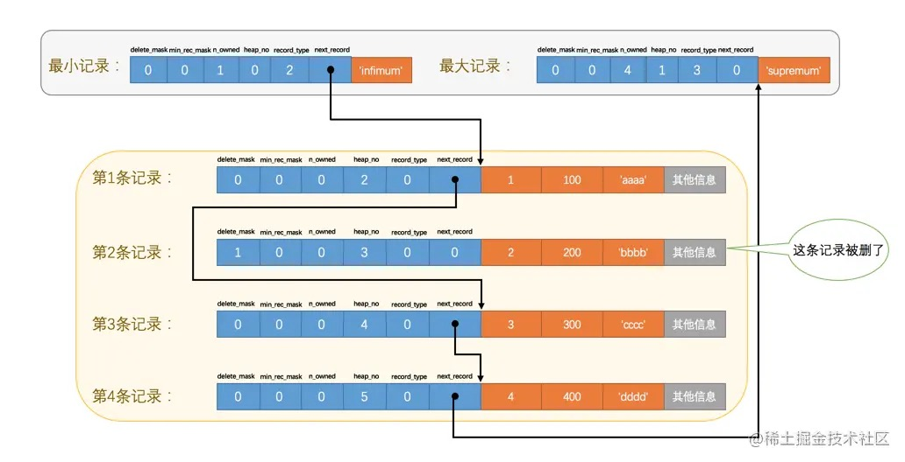
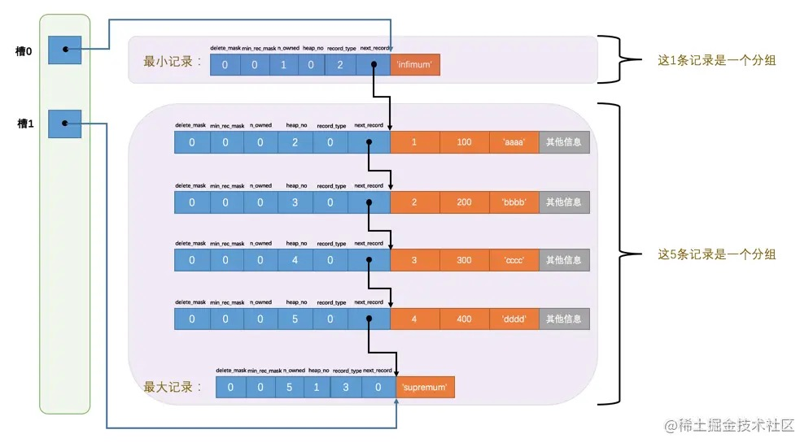

# 05-InnoDB数据页结构

## 5.1 不同类型的页简介

页是InnoDB管理存储空间的基本单位，一个页的大小一般是16KB。
InnoDB为了不同的目的而设计了许多种不同类型的页。
存放表中记录的页为索引页，或叫数据页。

## 5.2 数据页结构快览

| 名称 | 中文名 | 占用空间大小 | 简单描述 |
| ------------------ | ---------------- | ------------ | ------------------------ |
| File Header        | 文件头部           | `38`字节     | 页的一些通用信息         |
| Page Header        | 页面头部           | `56`字节     | 数据页专有的一些信息     |
| Infimum + Supremum | 最小记录和最大记录   | `26`字节     | 两个虚拟的行记录         |
| User Records       | 用户记录           | 不确定       | 实际存储的行记录内容     |
| Free Space         | 空闲空间           | 不确定       | 页中尚未使用的空间       |
| Page Directory     | 页面目录           | 不确定       | 页中的某些记录的相对位置 |
| File Trailer       | 文件尾部           | `8`字节      | 校验页是否完整           |

## 5.3 记录在页中的存储

记录会按照指定的行格式存储到`User Records`部分。

**记录头信息的秘密**

- `delete_mask`
  
  这个属性标记当前记录是否被删除，0代表记录没有被删除，1代表记录被删除。

  删除记录只是打一个删除标记而已，所有被删除掉的记录会组成一个垃圾链表，这个链表中的记录占用的空间为可重用空间，新纪录插入可以的话会重用。

- `min_rec_mask`
  
  B+树每层非叶子节点中的最小记录会添加该标记，我们插入的记录的min_rec_mask值都是0。

- `n_owned`
  
  页目录查找时使用，标识当前记录所在槽分组中共有多少条记录。

- `heap_no`
  
  这个属性表示当前记录在本页中的位置，我们的4条记录在本页中的位置分别是：2、3、4、5。

  最小记录和最大记录的`heap_no`值分别是0和1，它们的位置最靠前。

  最小记录和最大记录单独放在一个称为`Infimum + Supremum`的部分。

  最小记录和最大记录都是由5字节大小的记录头信息和8字节大小的一个固定的部分组成：

  

- `record_type`
  
  这个属性表示当前记录的类型，一共有4种类型的记录，0表示普通记录，1表示B+树非叶节点记录，2表示最小记录，3表示最大记录。

- `next_record`
  
  表示从当前记录的真实数据到下一条记录的真实数据的地址偏移量。

  这样记录就形成一个链表，可以通过一条记录找到它的下一条记录。
  
  需要注意的是下一条记录指按照主键值由小到大的顺序的下一条记录。
  
  规定 Infimum记录是最小记录，Supremum记录是最大记录。

  如果删除一条记录，这个链表也是会跟着变化：

  

  删除第2条记录前后发生的变化：
  - 第2条记录没有从存储空间中移除，而是把该条记录的delete_mask值设置为1。
  - 第2条记录的next_record值变为了0，意味着该记录没有下一条记录了。
  - 第1条记录的next_record指向了第3条记录。
  - 最大记录的n_owned值从5变成了4。
  

**提示**

当数据页中存在多条被删除掉的记录时，这些记录的next_record属性将会把这些被删除掉的记录组成一个垃圾链表，以备之后重用这部分存储空间。

## 5.4 Page Directory（页目录）

页目录是为了加快页内查询设计的目录结构。

页目录建立过程：

1. 将所有正常的记录（包括最大和最小记录，不包括标记为已删除的记录）划分为几个组。

2. 每个组的最后一条记录（也就是组内最大的那条记录）的头信息中的`n_owned`属性表示该记录拥有几条记录，也就是该组内共有几条记录。

3. 将每个组的最后一条记录的地址偏移量按顺序存储到 Page Directory，也就是页目录。页面目录中的这些地址偏移量被称为槽，所以页面目录就是由槽组成的。

每个分组中的记录条数是有规定的：
- 对于最小记录所在的分组只能有 1 条记录。
- 最大记录所在的分组拥有的记录条数只能在 1-8 条之间。
- 剩下的分组中记录的条数范围只能在是 4-8 条之间。

分组步骤：
- 初始情况数据页里只有最小记录和最大记录两条记录，分属两个分组。
- 之后每插入一条记录都会从页目录中找到主键值比本记录的主键值大并且差值最小的槽，然后把该槽对应的记录的n_owned值加1，直到该组中的记录数等于8个。
- 之后再插入一条记录时会将组中的记录拆分成两个组，一个组中4条记录，另一个5条记录。

在一个数据页中查找指定主键值的记录的过程分为两步：
1. 通过二分法确定该记录所在的槽，并找到该槽对应分组中主键值最小的那条记录（前一个槽对应的记录的下一条记录就是这个最小记录）。
2. 通过记录的next_record属性遍历该槽所在的组中的各个记录。

## 5.5 Page Header（页面头部）

页面头部是数据页专有的，存储了数据页中存储的记录的状态信息，比如本页中已经存储了多少条记录，页目录中存储了多少个槽等，共占用固定的56个字节。

| 名称              | 占用空间大小 | 描述                                                         |
| ----------------- | ------------ | ------------------------------------------------------------ |
| PAGE_N_DIR_SLOTS  | `2`字节      | 在页目录中的槽数量                                           |
| PAGE_HEAP_TOP     | `2`字节      | 还未使用的空间最小地址，也就是说从该地址之后就是`Free Space` |
| PAGE_N_HEAP       | `2`字节      | 本页中的记录的数量（包括最小和最大记录以及标记为删除的记录） |
| PAGE_FREE         | `2`字节      | 第一个已经标记为删除的记录地址（各个已删除的记录通过`next_record`也会组成一个单链表，这个单链表中的记录可以被重新利用） |
| PAGE_GARBAGE      | `2`字节      | 已删除记录占用的字节数                                       |
| PAGE_LAST_INSERT  | `2`字节      | 最后插入记录的位置                                           |
| PAGE_DIRECTION    | `2`字节      | 记录插入的方向                                               |
| PAGE_N_DIRECTION  | `2`字节      | 一个方向连续插入的记录数量                                   |
| PAGE_N_RECS       | `2`字节      | 该页中记录的数量（不包括最小和最大记录以及被标记为删除的记录） |
| PAGE_MAX_TRX_ID   | `8`字节      | 修改当前页的最大事务ID，该值仅在二级索引中定义               |
| PAGE_LEVEL        | `2`字节      | 当前页在B+树中所处的层级                                     |
| PAGE_INDEX_ID     | `8`字节      | 索引ID，表示当前页属于哪个索引                               |
| PAGE_BTR_SEG_LEAF | `10`字节     | B+树叶子段的头部信息，仅在B+树的Root页定义                   |
| PAGE_BTR_SEG_TOP  | `10`字节     | B+树非叶子段的头部信息，仅在B+树的Root页定义                 |

从`PAGE_N_DIR_SLOTS`到`PAGE_LAST_INSERT`以及`PAGE_N_RECS`已经介绍过了。

- PAGE_DIRECTION
  
  表示最后一条记录插入方向。假如新插入的一条记录的主键值比上一条记录的主键值大，则这条记录的插入方向是右边，反之则是左边。

- PAGE_N_DIRECTION
  
  标识沿着同一个方向连续插入记录的条数。 

## 5.6 File Header（文件头部）

文件头部针对各种类型的页通用，描述了各种页通用的一些信息，比如页的编号，上一个页、下一个页等等。这个部分占用固定的38个字节。

| 名称                             | 占用空间大小 | 描述                                                         |
| -------------------------------- | ------------ | ------------------------------------------------------------ |
| FIL_PAGE_SPACE_OR_CHKSUM         | `4`字节      | 页的校验和（checksum值）                                     |
| FIL_PAGE_OFFSET                  | `4`字节      | 页号                                                         |
| FIL_PAGE_PREV                    | `4`字节      | 上一个页的页号                                               |
| FIL_PAGE_NEXT                    | `4`字节      | 下一个页的页号                                               |
| FIL_PAGE_LSN                     | `8`字节      | 页面被最后修改时对应的日志序列位置（英文名是：Log Sequence Number） |
| FIL_PAGE_TYPE                    | `2`字节      | 该页的类型                                                   |
| FIL_PAGE_FILE_FLUSH_LSN          | `8`字节      | 仅在系统表空间的一个页中定义，代表文件至少被刷新到了对应的LSN值 |
| FIL_PAGE_ARCH_LOG_NO_OR_SPACE_ID | `4`字节      | 页属于哪个表空间                                             |

几个目前比较重要的部分：

- FIL_PAGE_SPACE_OR_CHKSUM
  
  当前页面的校验和。

- FIL_PAGE_OFFSET
  
  每一个页都有一个单独的页号，通过页号来可以唯一定位一个页。

- FIL_PAGE_TYPE
  
  页的类型，有很多别的类型的页，具体如下表：

| 类型名称 | 十六进制 | 描述 |
| ----------------------- | ------ | --------------- |
| FIL_PAGE_TYPE_ALLOCATED | 0x0000 | 最新分配，还没使用 |
| FIL_PAGE_UNDO_LOG       | 0x0002 | Undo日志页 |
| FIL_PAGE_INODE          | 0x0003 | 段信息节点 |
| FIL_PAGE_IBUF_FREE_LIST | 0x0004 | Insert Buffer空闲列表 |
| FIL_PAGE_IBUF_BITMAP    | 0x0005 | Insert Buffer位图 |
| FIL_PAGE_TYPE_SYS       | 0x0006 | 系统页 |
| FIL_PAGE_TYPE_TRX_SYS   | 0x0007 | 事务系统数据 |
| FIL_PAGE_TYPE_FSP_HDR   | 0x0008 | 表空间头部信息 |
| FIL_PAGE_TYPE_XDES      | 0x0009 | 扩展描述页 |
| FIL_PAGE_TYPE_BLOB      | 0x000A | 溢出页 |
| FIL_PAGE_INDEX          | 0x45BF | 索引页，也就是我们所说的`数据页` |

- FIL_PAGE_PREV 和 FIL_PAGE_NEXT
  
  InnoDB以页为单位存放数据，数据分散在各个可能不连续的页中。
  
  FIL_PAGE_PREV 和 FIL_PAGE_NEXT 分别代表本页的上一个和下一个页的页号。
  
  这样就把这些不连续的页使用一个双向链表串联了起来。
  
  需要注意，并不是所有类型的页都有上一个和下一个页的属性，不过数据页是有这两个属性的。

## 5.7 File Trailer（文件尾部）

文件尾部和文件头部一样，都是所有类型的页通用的。

InnoDB存储引擎把数据存储到磁盘上，但是磁盘速度慢，需要以页为单位把数据加载到内存中处理，处理完成后还需要在某个时间把修改后的数据页同步到磁盘中。
为了检测一个页是否完整的同步到了磁盘，在每个页的尾部都加了一个文件尾部，由8个字节组成，分成2个小部分：

- 前4个字节代表页的校验和
  
  这个部分和文件头部中的校验和相对应。
  
  当一个页面在内存中修改了，在同步之前就要把它的校验和算出来，因为文件头部在页面的前边，所以校验和会被首先同步到磁盘，当完全写完时，校验和也会被写到页的尾部，如果完全同步成功，则页的首部和尾部的校验和应该是一致的。如果因为其他原因只写了一半，那么在文件头部中的校验和就代表着已经修改过的页，而在文件尾部中的校验和代表着原先的页，二者不同则意味着同步中间出了错。

- 后4个字节代表页面被最后修改时对应的日志序列位置（LSN）
  
  这个部分也是为了校验页的完整性的，后续介绍。

# 完